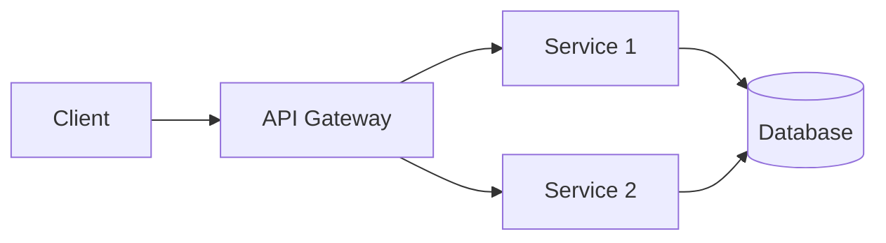

# Documentation Category (10% Weight)

The Documentation category measures the quality and completeness of your project's documentation. Good documentation helps AI agents understand project context, architecture, and usage.

## Why Documentation Matters for Agents

AI agents benefit from good documentation because:

1. **Context** - Understand project purpose and architecture
2. **Usage Examples** - Learn how to use APIs and functions
3. **Onboarding** - Quickly understand codebase structure
4. **Standards** - Learn project conventions and guidelines
5. **API Contracts** - Understand interfaces and data models

**Without documentation, agents must infer everything from code alone.**

## What This Category Checks

### README Quality (Weight: 2.5)

A comprehensive README.md at repository root.

**Essential sections:**
- Project description
- Installation instructions
- Usage examples
- Development setup
- Contributing guidelines (or link to CONTRIBUTING.md)

**Example README.md structure:**
```markdown
# Project Name

Brief description of what the project does.

## Features

- Feature 1
- Feature 2
- Feature 3

## Installation

```bash
pip install myproject
```

## Quick Start

```python
from myproject import MyClass

obj = MyClass()
obj.do_something()
```

## Documentation

Full documentation available at https://docs.example.com

## Development

```bash
git clone https://github.com/org/repo
cd repo
pip install -e '.[dev]'
pytest
```

## Contributing

See [CONTRIBUTING.md](CONTRIBUTING.md)

## License

MIT License - see [LICENSE](LICENSE)
```

**Weight factors:**
- Length > 100 lines: 2.5
- Length > 50 lines: 2.0
- Length > 20 lines: 1.5
- Exists: 1.0

### Documentation Directory (Weight: 2.0)

Dedicated documentation directory with guides.

**Common locations:**
- `docs/`
- `documentation/`
- `doc/`

**Expected contents:**
```
docs/
├── index.md           # Documentation home
├── installation.md
├── usage.md
├── api/              # API documentation
│   ├── classes.md
│   └── functions.md
├── guides/           # How-to guides
│   ├── getting-started.md
│   └── deployment.md
└── development/      # Developer docs
    ├── architecture.md
    └── contributing.md
```

### API Documentation (Weight: 1.5)

Auto-generated or manually written API docs.

**Python:**
- Sphinx configuration (`docs/conf.py`, `docs/source/`)
- Docstrings in code
- `mkdocs.yml` (MkDocs)

**Example Sphinx setup:**
```python
# docs/conf.py
project = 'MyProject'
extensions = [
    'sphinx.ext.autodoc',
    'sphinx.ext.napoleon',
    'sphinx.ext.viewcode',
]
html_theme = 'sphinx_rtd_theme'
```

**JavaScript/TypeScript:**
- JSDoc comments
- TypeDoc configuration (`typedoc.json`)
- API Extractor

**Example TypeDoc:**
```json
{
  "entryPoints": ["src/index.ts"],
  "out": "docs",
  "theme": "default"
}
```

**Go:**
- Godoc comments
- Package documentation

**Rust:**
- Rustdoc comments
- `cargo doc`

### OpenAPI/Swagger Specs (Weight: 1.5)

API specification files for REST APIs.

**Files:**
- `openapi.yaml` / `openapi.json`
- `swagger.yaml` / `swagger.json`
- `api-spec.yaml`

**Example openapi.yaml:**
```yaml
openapi: 3.0.0
info:
  title: My API
  version: 1.0.0
  description: API for managing resources

paths:
  /users:
    get:
      summary: List users
      responses:
        '200':
          description: Successful response
          content:
            application/json:
              schema:
                type: array
                items:
                  $ref: '#/components/schemas/User'

components:
  schemas:
    User:
      type: object
      properties:
        id:
          type: integer
        name:
          type: string
        email:
          type: string
```

### Contributing Guidelines (Weight: 1.5)

Guide for contributors.

**Files:**
- `CONTRIBUTING.md`
- `.github/CONTRIBUTING.md`
- `docs/contributing.md`

**Example CONTRIBUTING.md:**
```markdown
# Contributing

## Development Setup

1. Fork the repository
2. Clone your fork
3. Install dependencies: `pip install -e '.[dev]'`
4. Create a branch: `git checkout -b feature/my-feature`

## Making Changes

1. Write tests for your changes
2. Ensure tests pass: `pytest`
3. Run linters: `ruff check .`
4. Commit with clear message

## Pull Request Process

1. Update documentation
2. Add tests
3. Ensure CI passes
4. Request review

## Code Style

- Follow PEP 8
- Use type hints
- Write docstrings
- Keep functions small

## Testing

Run full test suite:
```bash
pytest tests/ --cov
```
```

### Changelog (Weight: 1.0)

Version history and release notes.

**Files:**
- `CHANGELOG.md`
- `CHANGES.md`
- `HISTORY.md`
- `NEWS.md`

**Example CHANGELOG.md:**
```markdown
# Changelog

All notable changes to this project will be documented in this file.

The format is based on [Keep a Changelog](https://keepachangelog.com/).

## [Unreleased]

### Added
- New feature X

## [1.2.0] - 2024-12-25

### Added
- Feature A
- Feature B

### Changed
- Improved performance of function X

### Fixed
- Bug in module Y

## [1.1.0] - 2024-11-01

### Added
- Initial release
```

### Code of Conduct (Weight: 0.8)

Community guidelines and behavior standards.

**Files:**
- `CODE_OF_CONDUCT.md`
- `.github/CODE_OF_CONDUCT.md`

### Architecture Documentation (Weight: 1.0)

High-level architecture docs.

**Files:**
- `docs/architecture.md`
- `docs/design/`
- `ARCHITECTURE.md`
- Architecture Decision Records (ADRs) in `docs/adr/`

**Example architecture.md:**
```markdown
# Architecture

## Overview

This application follows a three-tier architecture:

1. **Presentation Layer** - Web UI (React)
2. **Business Logic Layer** - API server (Flask)
3. **Data Layer** - PostgreSQL database

## Components

### API Server
- Framework: Flask
- Authentication: JWT
- Database: SQLAlchemy ORM

### Frontend
- Framework: React
- State: Redux
- Styling: Tailwind CSS

## Data Flow

```
User → Frontend → API → Database
                    ↓
                 Redis Cache
```

## Deployment

- Containerized with Docker
- Orchestrated with Kubernetes
- CI/CD via GitHub Actions
```

### Inline Code Documentation (Weight: 1.2)

Docstrings and comments in code.

**Python example:**
```python
def calculate_score(data: dict) -> float:
    """Calculate the agent readiness score.

    Args:
        data: Dictionary containing scan results with keys:
            - categories: List of category results
            - weights: Dictionary of category weights

    Returns:
        Final score from 0-100

    Raises:
        ValueError: If data is malformed or missing required keys

    Example:
        >>> data = {'categories': [...], 'weights': {...}}
        >>> score = calculate_score(data)
        >>> print(f"Score: {score}/100")
        Score: 85.5/100
    """
    # Implementation
    pass
```

**TypeScript example:**
```typescript
/**
 * Calculates the agent readiness score.
 *
 * @param data - Scan results containing categories and weights
 * @returns Final score from 0-100
 * @throws {Error} If data is malformed
 *
 * @example
 * ```typescript
 * const score = calculateScore(data);
 * console.log(`Score: ${score}/100`);
 * ```
 */
function calculateScore(data: ScanData): number {
  // Implementation
}
```

### Examples Directory (Weight: 1.0)

Working code examples.

**Structure:**
```
examples/
├── basic_usage.py
├── advanced_features.py
├── integrations/
│   ├── flask_app.py
│   └── fastapi_app.py
└── README.md
```

## Scoring Examples

### Example 1: Minimal Docs (Score: 20/100)

```
repo/
├── README.md           # ✓ Basic (1.0)
└── src/
```

**Score:** ~20/100 | **Contribution:** 2.0

### Example 2: Good README (Score: 40/100)

```
repo/
├── README.md           # ✓ Comprehensive (2.5)
├── CONTRIBUTING.md     # ✓ Contributing (1.5)
└── src/
```

**Score:** ~40/100 | **Contribution:** 4.0

### Example 3: Good Documentation (Score: 70/100)

```
repo/
├── README.md           # ✓ (2.5)
├── CONTRIBUTING.md     # ✓ (1.5)
├── CHANGELOG.md        # ✓ (1.0)
├── docs/               # ✓ (2.0)
│   ├── index.md
│   └── usage.md
└── src/
```

**Score:** ~70/100 | **Contribution:** 7.0

### Example 4: Excellent (Score: 95/100)

```
repo/
├── README.md                   # ✓ (2.5)
├── CONTRIBUTING.md             # ✓ (1.5)
├── CHANGELOG.md                # ✓ (1.0)
├── CODE_OF_CONDUCT.md          # ✓ (0.8)
├── openapi.yaml                # ✓ (1.5)
├── docs/                       # ✓ (2.0)
│   ├── index.md
│   ├── architecture.md         # ✓ (1.0)
│   ├── api/
│   └── guides/
└── examples/                   # ✓ (1.0)
```

**Score:** 95/100 | **Contribution:** 9.5

## Improvement Roadmap

### Level 1: Better README (Target: 30/100)

Expand README to include:
- Clear description
- Installation steps
- Usage examples
- Contributing section

### Level 2: Add Core Docs (Target: 50/100)

```bash
# Create CONTRIBUTING.md
cat > CONTRIBUTING.md << 'EOF'
# Contributing

See README.md for development setup.

## Pull Requests
- Write tests
- Update docs
- Follow code style
EOF

# Create CHANGELOG.md
cat > CHANGELOG.md << 'EOF'
# Changelog

## [Unreleased]
- Initial release
EOF
```

### Level 3: Documentation Site (Target: 75/100)

```bash
# Create docs directory
mkdir -p docs/{guides,api}

# Using MkDocs
pip install mkdocs mkdocs-material
mkdocs new .

# Edit mkdocs.yml
cat > mkdocs.yml << 'EOF'
site_name: My Project
theme:
  name: material
nav:
  - Home: index.md
  - Installation: installation.md
  - Usage: usage.md
  - API: api/
EOF

mkdocs serve  # Preview at localhost:8000
```

### Level 4: API Documentation (Target: 90/100)

```bash
# Python with Sphinx
pip install sphinx sphinx-rtd-theme
sphinx-quickstart docs

# TypeScript with TypeDoc
npm install --save-dev typedoc
npx typedoc src/

# Add OpenAPI spec
# Use tools like swagger-editor or write manually
```

## Best Practices

### 1. Keep README Current

Update README when:
- Installation process changes
- New features added
- Breaking changes introduced

### 2. Use Documentation Generators

**Python:**
```bash
# Generate from docstrings
sphinx-apidoc -o docs/api src/
sphinx-build docs/ docs/_build
```

**TypeScript:**
```bash
npx typedoc --out docs src/
```

### 3. Version Documentation

```
docs/
├── v1.0/
├── v2.0/
└── latest/ -> v2.0/
```

### 4. Include Visual Aids

```markdown
## Architecture


```

### 5. Test Documentation Examples

```python
# Use doctest
def add(a: int, b: int) -> int:
    """Add two numbers.

    >>> add(2, 3)
    5
    >>> add(-1, 1)
    0
    """
    return a + b
```

Run doctests:
```bash
python -m doctest mymodule.py
```

## Common Pitfalls

### Pitfall 1: Outdated Documentation

**Problem:** Docs don't match current code

**Solution:** Review and update docs in PR process

### Pitfall 2: Installation Instructions Don't Work

**Problem:** README setup fails on fresh install

**Solution:** Test installation in clean environment

### Pitfall 3: No Examples

**Problem:** API docs but no usage examples

**Solution:** Add examples/ directory with working code

### Pitfall 4: Missing Docstrings

**Problem:** Public APIs lack documentation

**Solution:** Require docstrings in code review

## Quick Wins

**1 hour:**

1. Expand README (installation, usage, examples)
2. Create CONTRIBUTING.md
3. Create CHANGELOG.md
4. Add docstrings to main functions

**Result:** Score 20 → 60+

## Tool Recommendations

### Python
- **Sphinx** - Comprehensive documentation
- **MkDocs** - Markdown-based, simple
- **pdoc** - Auto-generate from docstrings

### JavaScript/TypeScript
- **TypeDoc** - TypeScript documentation
- **JSDoc** - JavaScript documentation
- **Docusaurus** - Full documentation site

### API Documentation
- **Swagger UI** - Interactive API docs
- **Redoc** - Clean OpenAPI renderer
- **Stoplight** - API design and docs

## Further Reading

- [Write the Docs](https://www.writethedocs.org/)
- [Documentation Guide](https://www.divio.com/blog/documentation/)
- [Keep a Changelog](https://keepachangelog.com/)
- [Semantic Versioning](https://semver.org/)

## Next Steps

- Review [Static Typing](typing.md) category
- Learn about [Extending](../extending.md) the scanner
- Check [CI Integration](../ci-integration.md)
